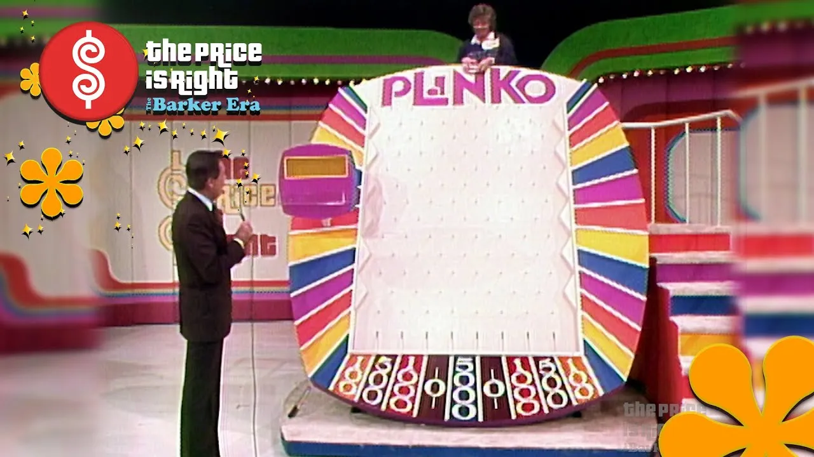
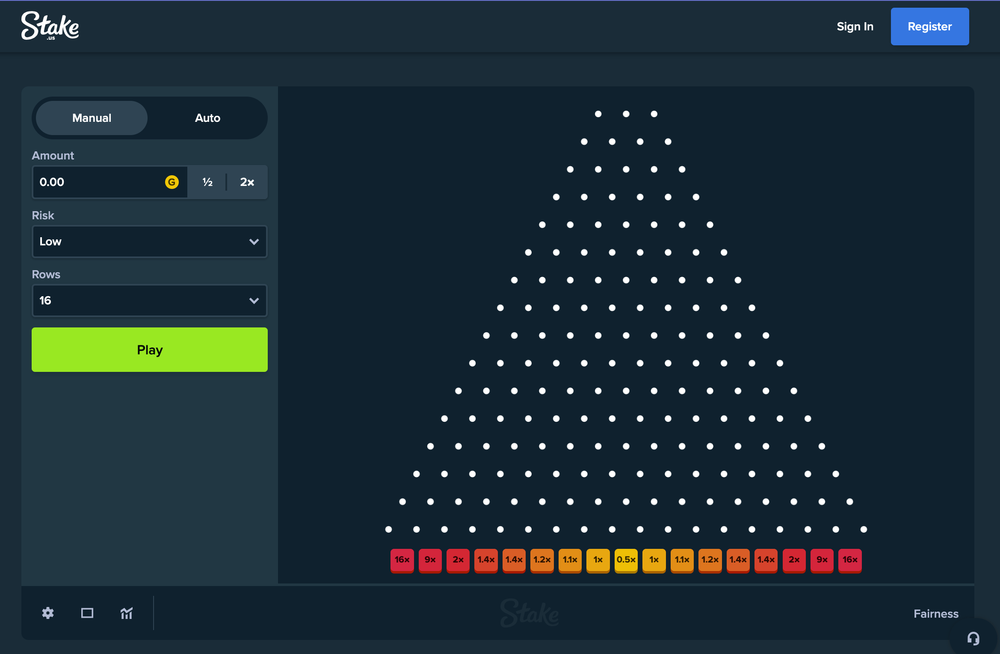
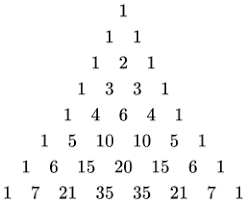
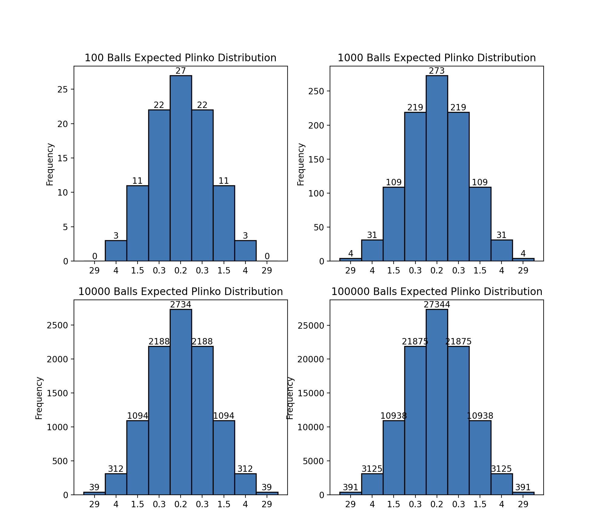
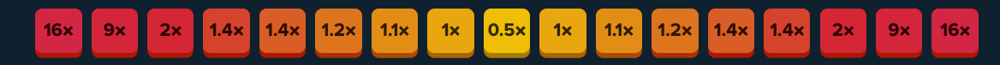
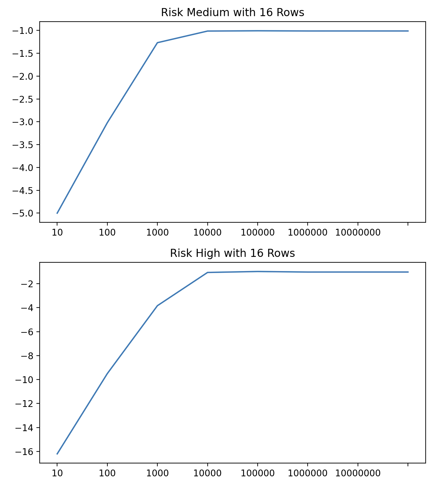
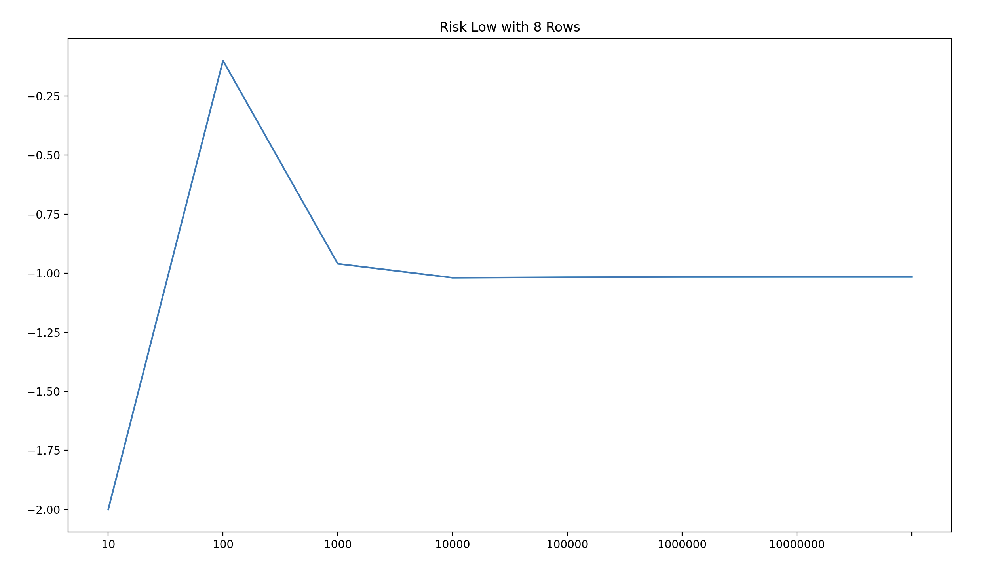
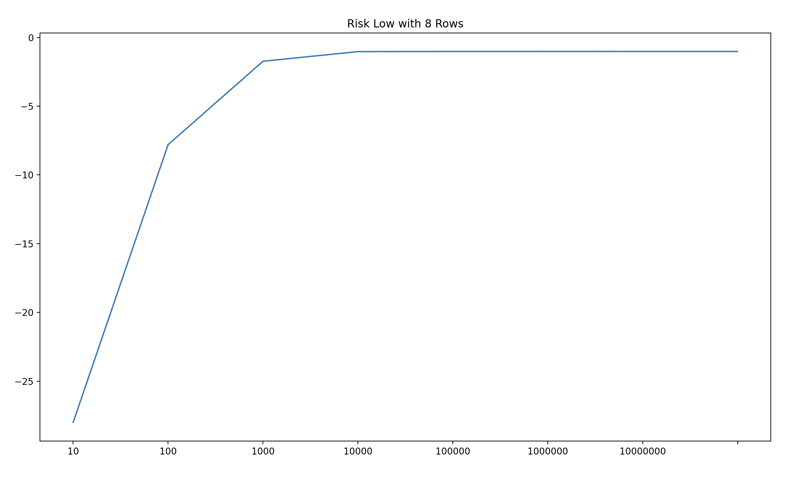

# Plinko Odds Analysis

## Explanation
Plinko is an game instroduced by the Price is right in 1983 where contestants would drop a ball to fall down a series of pegs and eventually land in one the slots containing various prizes. 

Since its inception multiple of the fast growing gambling websites such as Stake.com have adopted the game adding its own twists. 

This version of the game has gone viral over the past year being streamed by some of the most popular twitch streamers and showing up on tiktok and reels. The game has blown up so much that I thought it would be interesting to look into the odds of this variation of the game and see how possible it is to win or lose money while playing. Are the odds stacked in the house's favor or is there a possible winning strategy.

## Probabilities of Plinko
The study probabilities of plinko predate the plinko game itself. In order to understand the odds of landing on each multiplier lets assume a few things:

- the board extends to form the full triangle
- when a ball lands on a peg it has a 50/50 chance of going right or left

In this case a ball landing on a individual multipler is the sum of all paths the ball can take starting from the top to that multiplier all divided by the total number of paths.

    numPathsToMultiplier / totalPaths = odds of hitting

With this we can exaustively calculate the number of paths to each multiplier given the number of rows of pegs. If you start doing this you'll begin to notice that the probabilities start to match Pascal's triangle. 

In fact all the odds can be matched with the values of Pascal's triangle. So if you wanted to know the odds of hitting the far left multiplier of an 8 row plinko board you can look at the 8th row of Pascal's triangle on the far left and divide that by the 2^(8-1).

In this case: `1 / 2^(8-1) = 1/128 = 0.78% chance`

`Note: the exponent is number of rows - 1 because we must start at 0 when counting paths from row 1. In other words the rows are 0 indexed. i. e. there are 2^0 = 1 ways to get to the first peg at the top of the triangle.`

`Second Note: Stake's Plinko boards have ROW_COUNT+1 multipliers that sit below the pegs so this equation conveniently becomes 1/(2^(ROW_COUNT))`

If you were to let a large numbers balls fall and allow them to stack up they'll start to look similar to another popular concept in statistics, a normal distribution.

See more about this on 3Blue1Brown's [video](https://www.3blue1brown.com/lessons/clt) on the central limit theorem.

So what we can learn from this is that after a larger number of dropped balls, a player's results should resemble a normal distribution.

## Rules
In Stake's verison of the game the player has 3 main configuration choices. 

Amount: The cost of each individual ball dropped
Risk: The risk the user wants to take. Higher risk equals larger multipliers on the outside and smaller on the inside
Rows: The amount of rows of pegs the ball can be dropped through

Once a ball is dropped the balls cost will be multiplied by whatever factor it lands on at the bottom. That balance is returned to the player.

## Analysis
#### Distributions
Let's look at actual numbers now. To do this I wrote some python leveraging matplotlib to calculate and chart some results.

First lets look at how you can expect your balls to land with different amounts of drops. On the 16 row low risk board

You might notice that the ball counts don't add up to their totals. This is because we have to round the totals in some way to get whole numbers. You might be tempted to think that those missing balls could've been the ones to hit big. While every ball has a chance to go all the way right or left it's still more likely that those missing balls would have ended up towards the middle in practice.

Because of this we can only accurately use these charts to get a general idea of what we'll see. Its only when we start to look at a huge number of drops that we can really predict distributions.

From the graphs we can see the balls in each bin increases by the same factor as total number of balls increased. In this case a factor of 10. I think the most important thing to gleam from these graphs is that once you start dropping a ton of balls you can actually expect to hit these large multipliers. 

So the next question is whether there is a number of balls you can drop that might on average produce a profit? The short answer is NO (unless you round generously).

#### Profits
Lets look at some predicted profits. I'll be calculating expected profits by looking at the expected number of balls that hit each multiplier and multiplying it with the ball cost and the multiplier. Subtract the money you put in from this and you get profit.

`numBallsPerMultiplier = oddsOfHitting * totalBallCount`
`EndAmount = Sum(numBallsPerMultiplier * multiplier) * ballCost`
`StartingAmount = ballCost * totalBallCount`
`Profit = EndAmount - StartingAmount`

For the low risk board with 16 rows your expected return will be:

`StaritngAmount: 1000.00`
`-47.00 = 953.00 - 1000.00`
A loss of 4.7%

This is only if you floor each ball count though. If we were to round the ball counts to whole numbers instead we would get:

100 balls of cost $10:
`StaritngAmount: 1000.00`
`-32.00 = 968.00 - 1000.00`
A loss of 3.2%

In this scenerio rounding actually causes the outer edge multipliers to be counted more than they would be originally. This tilts the odds in the players favor and still results in a overall loss. With such a small number of balls we can't expect a normal distribution to reflected this purely anyways so let's look at how larger ball counts change expected returns.

Flooring:

Rounding:

Both strategies end up trending the same way which isn't surprising. Another thing we can see is that no matter how many balls you use you can expect negative returns. Actually the more balls that are used the more the normalized the distribution should be making it more likely you'll see these negative returns.

This is only for the low risk board with 16 rows. Lets look at Medium and High risk boards of 16 rows. These each start to have huge multipliers on the outsides.

We can see whatever risk you take you can expect similar returns in the long run. The larger multipliers end up be negated by the larger amount of smaller multipliers in the center.

I found this reddit [thread](https://www.reddit.com/r/stakeus/comments/1e0hcwh/low_risk_8_row_plinko_is_the_new_meta/) while researching.

So, let's test out this meta.

A strange trend emerges here because we are using the rounding method to get ball counts per bin. It looks like around 1000 we should be almost netting 0 but this is really marking the point where outer edge multipliers begin to get rounded up rather than down. It is a misleading graph and even with this edge given to the player they still will end up losing money even in the best case. 

A more accurate graph is seen with flooring. Although really a mix of the two is more accurate.

Pertaining to this reddit user's strategy, betting 40 dollars per ball with a $300 balance is not very likely to result in a the average case. They are mostly relying on pure chance and the odds are stacked against them even in the best case.

## Conclusions

One of the most interesting observations I made while looking into this was that risk, although appearing to alter the risk level, always results with similar percentages of losses in the long run. Really the average person is not going to be able to drop 1 million balls. Just looking at the odds you can see you have to get enormously lucky to ever end up profitting from this game with whatever number of balls. My biased view from what I've seen on internet is people trying to hit big with a single ball. They'll set ball cost to a huge number and only drop a small number of balls. To really hit it big they'll strive for the 1000x multiplier only available on 16+ rows at high risk. Your chance of hitting either 1000x is `1/65536`. Since there are 2 it's `1/32768`. So in 32000 drops you can expect to hit that 1000x once.

All this math is based off the assumption that you have a 50/50 chance of going either direction on each peg. Really this a programmed similulation of physics where variables can be skewed toward the houses favor. While I'm not accusing Stake of rigging the game, I would not personally want to rely on them to keep my best interests at heart in this case. We even saw that if they leaned it in our favor we were still expected to lose.

Without going into any psychological aspects of the game, this game is highly predatory to users. It hangs the possibility of huge returns in your face while staying safe behind a shield of statistics bent in their favor. If you're debating playing this game or currently play it I encourage you not to. There are plenty of much more entertaining ways to spend money.
